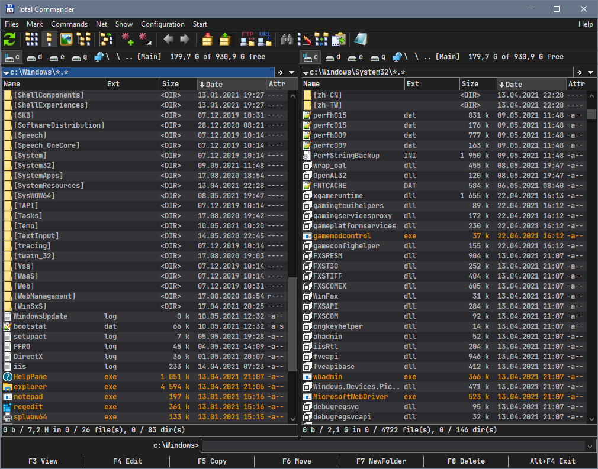

# Sunset Asphalt - A Total Commander Theme 
A simple, minimalistic dark theme for Total Commander

## Screenshot


## Instalation
Copy `colors-sunset-asphalt.ini` and `colors-dark-sunset-asphalt.ini` to `%APPDATA%\GHISLER\`

Open the `%APPDATA%\GHISLER\wincmd.ini` file and replace the `[Colors]` and `[ColorsDark]` sections with the code below:
```
[Colors]
RedirectSection=colors-sunset-asphalt.ini
[ColorsDark]
RedirectSection=colors-dark-sunset-asphalt.ini
```